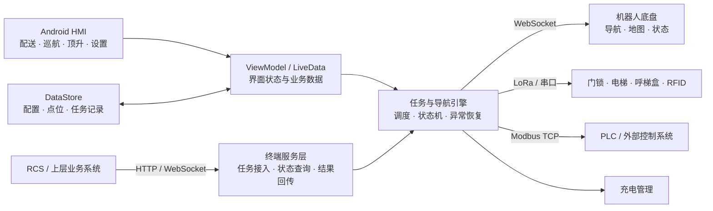

# E300-Tray

> 面向平台式配送机器人的 Android 终端控制应用，将任务调度、底盘导航、跨楼层乘梯、外设通信与现场配置集中在一套人机交互终端中。


## 项目简介

E300-Tray 是 E300 平台式配送机器人的 Android 人机交互终端。应用运行在机器人触控设备上，承接来自本地操作界面及上层系统的任务，将任务转换为底盘导航、乘梯、外设控制和充电等动作，并持续回传机器人状态和任务结果。

项目围绕机器人业务链路组织代码，覆盖任务创建、执行、取消、异常恢复和历史记录，同时提供地图点位、电梯、呼梯盒、门锁、避障区域、语音及设备通信参数等现场配置能力。

## 核心能力

- **完整任务闭环**：支持配送、巡航和顶升任务，覆盖任务创建、排队、执行、取消、状态回传及记录管理。
- **跨楼层配送**：管理多建筑、多楼层地图点位与电梯配置，编排候梯、进梯、乘梯、出梯和楼层切换流程。
- **自主充电**：支持低电量充电、空闲充电和定时充电，并在任务执行与充电状态之间进行协调。
- **软硬件协同**：通过 WebSocket 对接机器人底盘，通过串口、LoRa、RFID 和 Modbus TCP 连接门锁、呼梯盒及其他外设。
- **上层系统集成**：内置 HTTP 与 WebSocket 服务，可接收任务、查询机器人状态、读取地图信息并同步任务进度。
- **现场配置能力**：提供地图点位、电梯、门锁、呼梯盒、避障区域、语音、用户和设备参数管理。
- **多语言界面**：包含中文、英文、日文、韩文、越南文、印尼文及繁体中文资源。

## 系统架构



## 主要模块

| 模块 | 职责 |
| --- | --- |
| `ui` | 机器人主界面、配送/巡航/顶升操作及配置页面 |
| `viewmodels` | 页面状态、配置数据与业务模型管理 |
| `navigation` | 任务执行、导航编排、充电、跨楼层及异常恢复 |
| `navigation/task` | 路线、点位、命令队列与导航状态管理 |
| `communication/chassis` | 底盘命令与状态 WebSocket 通信 |
| `communication/lora` | 电梯、呼梯盒等 LoRa 设备通信 |
| `communication/doorlock` | 门锁协议与状态管理 |
| `communication/rfid` | RFID 读卡与用户关联 |
| `communication/modbus` | Modbus TCP 从站与寄存器映射 |
| `web` | 本地 Web 控制页、RCS HTTP API 与实时 WebSocket 服务 |
| `data` | DataStore 封装、业务实体及任务链路备份 |

## 技术栈

- Java 11、Android SDK 35，最低支持 Android 7.0（API 24）
- Android ViewModel、LiveData、DataStore
- RxJava 3、OkHttp、Java-WebSocket
- NanoHTTPD / NanoHTTPD-WebSocket
- Gson、JSON
- j2mod、USB Serial、LoRa、RFID
- Glide、ZXing、Material Components

## 目录结构

```text
E300-Tray
├─ app
│  ├─ libs                 # 串口通信依赖
│  └─ src/main
│     ├─ java/com/ezhan/amr
│     │  ├─ communication  # 底盘与外设通信
│     │  ├─ data           # 持久化与数据模型
│     │  ├─ navigation     # 任务和导航核心
│     │  ├─ ui             # Activity 与 Fragment
│     │  ├─ viewmodels     # 状态与业务数据
│     │  └─ web            # HTTP / WebSocket 服务
│     └─ res               # 布局、图片、音视频及多语言资源
├─ gradle
├─ build.gradle.kts
└─ settings.gradle.kts
```

## 快速开始

### 环境要求

- Android Studio
- JDK 17（源码兼容级别为 Java 11）
- Android SDK 35
- 可访问 Google Maven、Maven Central 与 JitPack 的网络环境

Windows 下建议将项目放在纯英文路径，例如 `D:\Projects\E300-Tray`，避免 Android Gradle Plugin 的非 ASCII 路径检查。

### 构建项目

```powershell
git clone <your-repository-url>
cd E300-Tray
.\gradlew.bat :app:assembleDebug
```

首次构建需要联网下载 Gradle 依赖。构建产物位于 `app/build/outputs/apk/debug/`。

## 配置说明

| 文件/入口 | 用途 |
| --- | --- |
| `app/src/main/res/raw/app_config.json` | 本地 Web、RCS HTTP、RCS WebSocket 与 Modbus 服务开关及端口 |
| `app/src/main/res/raw/app_settings.json` | 默认业务参数、电梯、呼梯盒与地图区域配置 |
| 应用内“设备设置” | 底盘、云端及外设通信参数 |
| 应用内“地图/电梯设置” | 建筑、楼层、点位及乘梯流程配置 |

仓库中的 `192.0.2.10` 属于文档示例地址，无法用于连接真实设备。默认账号、RFID 卡号和密码也仅用于展示，部署前应全部替换。

## 开源副本说明

该仓库由设备项目的工作副本脱敏整理而来：

- 移除了原 Git 历史、内部功能文档和日志分析文件；
- 将固定口令、默认账号密码、RFID 卡号和局域网地址替换为演示值；
- 保留了默认的空点位、电梯、呼梯盒和地图区域配置；
- 保留了应用构建所需的串口依赖及图片、音视频资源。

## 部署与安全

当前服务设计面向受控局域网环境。若要部署到不受信任网络，应先补充接口身份认证、访问控制、TLS、凭据安全存储和备份数据保护。公开仓库中的演示凭据不得用于现场设备。

应用需要连接实际机器人底盘和外设才能验证完整业务流程；普通 Android 模拟器只能用于部分界面与非硬件逻辑调试。

## 构建验证

脱敏后已完成源码差异检查、敏感信息扫描及完整 Debug 构建，`gradlew.bat :app:assembleDebug` 执行成功。构建过程中存在项目原有的多语言格式字符串、弃用 API 和 native 符号处理警告，不影响本次 APK 生成。

## License

本项目采用 [MIT License](./LICENSE)。你可以在保留版权和许可声明的前提下使用、复制、修改、合并、发布和分发本项目。
